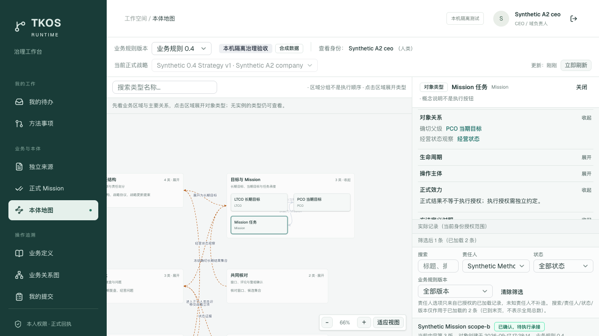
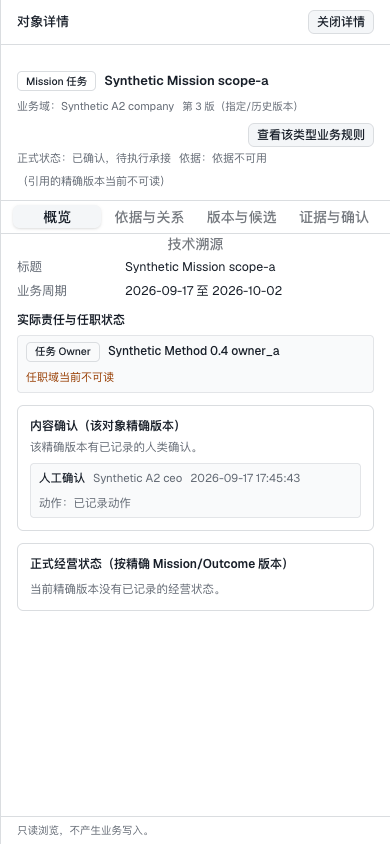

# 本体地图内的对象记录

本次将独立“对象列表”入口收进本体地图的“查看实际数据”。治理侧栏与只读浏览导航均不再重复显示该入口；记录详情、版本、关系与权限规则继续复用。

## 数据边界

搜索、责任人、正式状态和业务规则版本筛选作用于当前身份已加载的记录；有下一页时明确提示继续加载，不把当前条数解释成全库总数。责任人只使用选中内容版本已有的授权责任关系，排除参与人，不推断缺失 Owner。没有责任人字段的类型不会补造姓名。

旧列表链接转到地图记录或对象详情。对象及指定修订保持；旧域和周期条件无法在此目录读取中应用时明确提示，不假装已经筛选。

修正了 0.4 整组确认记录的读取映射：只有覆盖确切成员修订的正式确认记录与有效版本共同成立时才显示正式内容。未改变确认规则、身份、数据库模型或执行授权。

## 验收

Codex 使用真实本机服务和独立浏览器会话复核侧栏入口、实际记录、标题搜索、Owner 筛选、状态和规则版本、详情与移动端路径；相关 Python 回归 170 项通过；前端 172 项通过，类型检查、生产构建与资产清单验证通过。旧链接未携带战略但指定历史修订时，自动选择战略后仍保留指定版本；真实浏览器已核对第 1 版内容。测试账号与场景均为隔离合成数据，截图不含登录码或真实私有来源正文。

开发：pi（DeepSeek-flash、Max）。本机源码服务用于评审；提交与合并以 Git 记录为准，本报告不代表远程部署。
