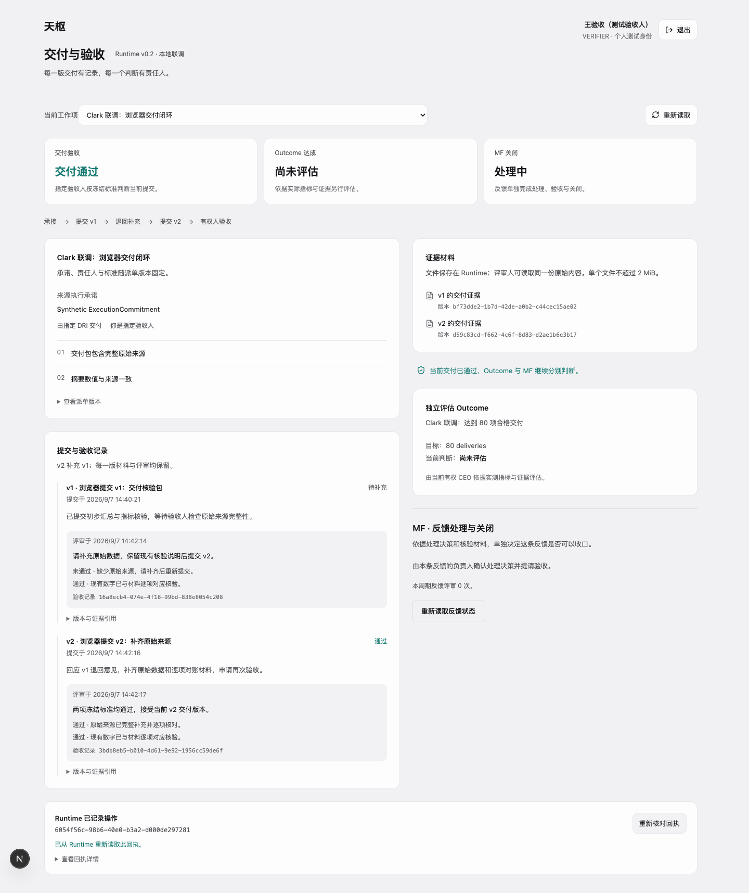

# Clark / Runtime v0.2 本地联调验收报告

2026-09-07，**Clark 本地业务联调通过**。运行编号 `clark-v02-0fcfdf991d35`，使用最新远程 Clark `d5bddaa` 为基线，在 `/delivery` 接入真实 Runtime。浏览器表单操作、Clark 服务端代理、Runtime 回执及 PostgreSQL 物理记录相互核对。

本次使用独立的合成人员身份和业务数据，不代表真实员工账号已接入、原有 Clark 业务数据已迁移、代码已发布或远程部署通过。Clark 全量回归另有一项已复现的上游基线失败，详见下文。

## 业务结果

| 页面操作阶段 | 交付 | Outcome | MF |
| --- | --- | --- | --- |
| DRI 承接、提交 v1，验收人退回 | 待补充 | 尚未评估 | 处理中 |
| DRI 提交 v2，指定验收人逐项通过 | 交付通过 | 尚未评估 | 处理中 |
| CEO 依据实测 72、目标 80 独立判断 | 交付通过 | 未达成 | 处理中 |
| CEO 依据后续实测 80 独立判断 | 交付通过 | 已达成 | 处理中 |
| MF 负责人确认处理决策、验收人核验、CEO 单独关闭 | 交付通过 | 已达成 | 已关闭 |

浏览器分别登录指定 DRI、验收人、CEO 和 MF 负责人，实际点击每个动作。证据上传与下载访问版本化 MinIO，业务写入不经过 Clark 本地对象库，也不以模拟响应代替 Runtime。

只读数据库核对确认：**2 个交付版本、2 条交付评审、2 条指标观察、2 条 Outcome 判断、1 条 MF 验收、1 次 MF 关闭**。11 条关键 Action Receipt 的实际 principal 与操作者一致；MF 展示的决策正文、revision 和 hash 与精确验收版本一致。

## 故障与边界

- 浏览器真实提交 v2，Runtime 提交成功后故意中断响应。页面刷新后手动按原请求重试，返回相同 Receipt `77388780-21bc-4645-90f7-4075feeaa0bd`，数据库没有第三个提交版本。
- 个人会话、固定 Origin/Host、路径与动作白名单、错误人员、角色伪造、域外读取、旧版本及幂等冲突均有拒绝证据。任务清单也按当前个人 Runtime 权限过滤，不向域外身份显示标题或关联 ID。
- 暂停本次 Runtime API 后，Clark 返回 `503 RUNTIME_UNAVAILABLE`，没有模拟成功或本地写入回落；恢复服务后真实读取恢复。
- 受控停止并恢复 Clark/API/Worker 后，WorkItem 和 Outcome 读取 hash 原样一致。Feedback 的既有字段、版本和引用一致，唯一新增项是 `feedback.resolution_decision_revision:null` 只读字段；因此不声称该对象原始 JSON 字节完全相等。业务对象没有重建。
- 页面在 390px 宽度下完成截图与无水平溢出检查。[手机结果](acceptance/clark-v02-05-mobile-390.png) 与 [最终三项状态](acceptance/clark-v02-04-three-independent-judgments.png) 可复核。

## 测试与构建

| 检查 | 结果 |
| --- | --- |
| Clark HTTP 联调 | 4 组通过 |
| 真实浏览器交付、Outcome、MF | 3 组通过 |
| 服务不可用、受控恢复、最终只读 SQL 核对 | 各自通过 |
| Clark 接入边界、client 与 changelog 检查 | 83 项通过 |
| Clark TypeScript、相关文件 ESLint、Next 构建 | 通过 |
| Clark 全量测试 | 2096 通过、12 跳过、1 项上游已有失败 |
| 最新 Runtime 完整独立验收 | 20 组通过，164 项 pytest 通过、1 项跳过，构建与恢复通过 |

Clark 唯一失败在 `src/app/api/chat/route.test.ts:176`：远程基线的对谈工具已加入 `report_calculate`，测试预期清单仍缺少它。用 `git archive HEAD` 建立的独立临时基线、仅复用依赖运行该测试，同样为 12 通过、1 失败。本次没有修改对谈逻辑或放宽其断言。[脱敏基线复现证据](acceptance/clark-v02-upstream-baseline.json)。

最新 Runtime 独立运行是 `runtime-9922503fbe7f`，已包含为 Clark 增加的 MF 只读投影。唯一跳过项仍是缺少既有 `agent_service` fixture 的非 human viewer 测试。此前 `runtime-a15a50851637` 是原 v0.2 独立验收的历史快照，两次报告分别保留。

## 代码与复验

- Runtime 分支：`codex/runtime-v0.2-dri-delivery`，基于 `a02d8b2`，本次核心只新增 MF 读取投影；新增联调 harness 在 `acceptance/clark_v02/`。
- Clark 分支：`codex/runtime-v0.2-clark-integration`，基于 `d5bddaa`，应用版本 `0.140.0`；新增个人联调会话、BFF、交付工作页与测试。
- 两仓库均为未提交工作树，没有提交、推送、合并或远程部署。代码以 [两仓库源文件 SHA256](acceptance/clark-v02-source-sha256.json) 为准，不能只用基线 commit 代表此次验收版本。
- [脱敏联调摘要](acceptance/clark-v02-summary.json)、[启动与复验方法](../acceptance/clark_v02/README.md)、[Runtime 契约](runtime-v0.2-dri-delivery-contract.md)。Clark 接入说明位于其仓库 `docs/runtime-v0.2-integration.md`。

本地服务保留在 `http://127.0.0.1:63917/delivery`，访问码按人保存在本次私有验收目录。完整报告、截图与 SQL 证据位于忽略目录 `artifacts/runtime-acceptance/clark-v02-0fcfdf991d35/`；凭据、数据库和原始私有配置没有纳入公开材料。

当前入口支持一个固定责任人与验收标准的交付流程，MF 页面覆盖 `no_change` 关闭路径。正式身份接入、已有任务映射、责任人改派、验收基线变更及远程部署需各自安排后续验证。
