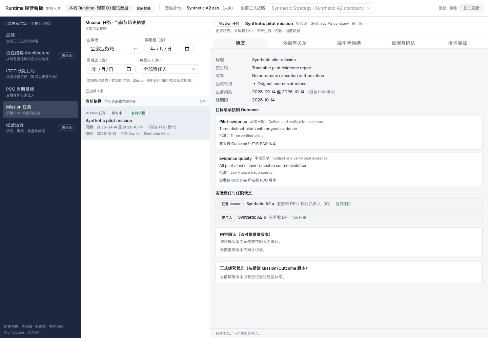
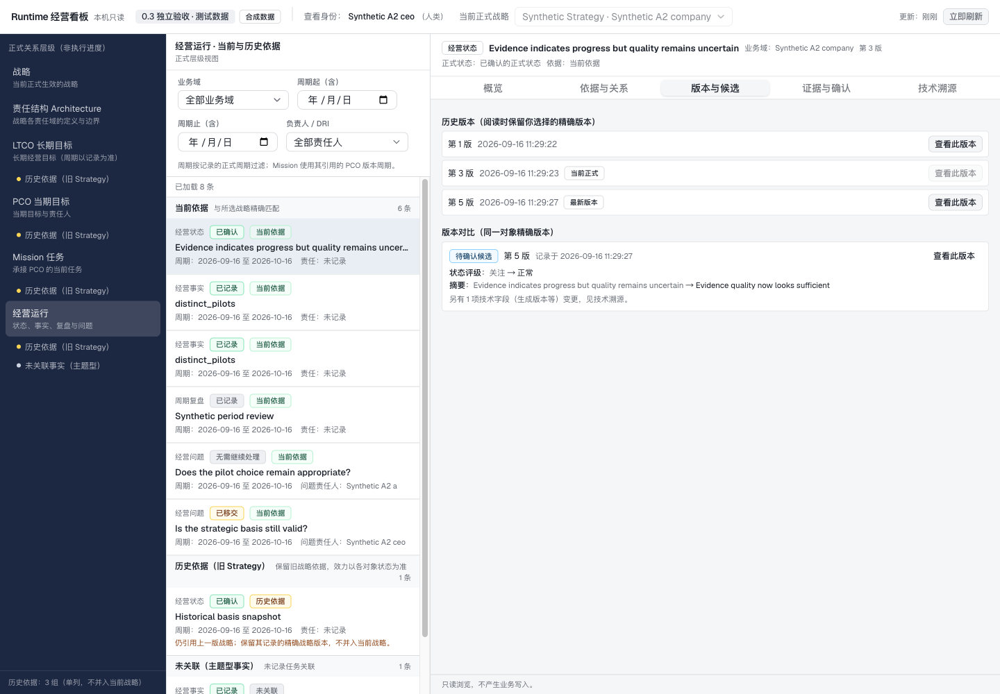

# Runtime 经营看板：本机独立验收报告

验收日期：2026-09-16。Pi CLI 0.85.1 实施，Codex 独立审查、真实浏览器验收及本机部署。
源码提交 `eccc346bb394243063c982555b8d48a05454406d`，隔离分支 `codex/runtime-business-dashboard`。
本轮只修改 Runtime。Clark、原 Runtime 脏工作区和旧独立工作区未修改。

## 交付状态

| 范围 | 结果 |
| --- | --- |
| Runtime 读取接口 | 通过 |
| Runtime 真实浏览器只读业务场景 | 通过：现有 0.1 数据副本、独立 0.3 合法场景及新容器上的现有 0.1 数据 |
| 本机容器切换 | 通过：API/Worker 使用本轮源码新镜像，五个容器均健康 |
| Clark 伙伴接线／Clark 浏览器闭环 | 本轮未验证 |
| 真实业务模型收拢 | 本看板不调用模型，本轮未运行该验收 |
| 业务同事理解度 | 待业务同事实际试用；自动化和浏览器检查不能替代该判断 |
| Release／远程生产部署 | 未发布新版；Release 仍为 v0.2.1；未做远程或生产部署 |

访问 [本机看板](http://127.0.0.1:58802/dashboard/)；原 [API 文档](http://127.0.0.1:58802/docs) 保留。
本机固定使用既有合成 CEO 查看身份，凭据仅存于权限受限的 Docker 命名卷，页面不接收 token。
其他环境默认关闭看板。构建使用官方 shadcn/ui CLI/组件、React、TypeScript、Vite 与 Tailwind，
全部静态资源打包进 Python wheel，未新增 Node 常驻服务。

## 数据与效力核对

当前运行库仍是原 0.1 测试数据：1 个正式 Strategy、1 个已确认 LTCO，PCO 与 Mission
正在共同核对，尚未正式生效；没有 Architecture、Operating State、BusinessFact、PeriodReview
或 Problem。看板据此显示“未记录”或“核对中”，没有导入 0.3 验收对象、自动迁移旧对象绑定
或补造经营成果。独立 0.3 数据只用于验证新对象和复杂状态。

浏览器实际检查包括：

- 当前目标与旧战略下的目标同屏分组；历史对象保留原战略／结构／PCO 精确版本。
- Mission 的交付物、期限、成果支持关系，真实 Owner／DRI／问题责任人及当前任职；
  已撤销任职明确标注，不把 Owner 等同于 DRI。
- 正式 Mission 显示“已确认，待执行承接”；确认记录包含本人姓名、时间、理由及可展开回执。
- 已确认经营状态与新建议分开；差异使用“关注 → 正常”等业务文案，不借用正式确认。
- 原始证据由浏览器下载，119 字节验收证据的 SHA-256 与服务端 ETag 一致。
- 对象／精确版本／责任人筛选写入 URL，刷新后恢复；前台轮询和手动刷新有效。
- 断网保留内容并明确标旧，恢复网络后刷新；无效查看凭据使身份、列表和详情清空，
  有效凭据恢复后刷新可重新读取。浏览器 localStorage、sessionStorage 与 cookie 均无凭据。
- 桌面 1440px 与手机 390px 检查；手机详情占满可用宽度、正文换行、页签可达、关闭有效。

浏览器作用域前后核对 45 张表，内容哈希与行数均不变。浏览未创建 Context 快照、回执、
任务、执行授权、交付验收或目标达成记录。

## 代码与接口检查

| 检查 | 结果与范围 |
| --- | --- |
| 后端 dashboard | 76 passed |
| 前端 | 56 passed，TypeScript 检查与 Vite 生产构建通过 |
| 既有 Python | 699 项先通过；迁移用例改用专门 owner/admin 环境后 1 passed；legacy 专门环境另 14 passed；1 项既有环境跳过 |
| 既有 Workbench Node | 61 passed |
| 原 Anchor 0.3 独立回归 | 35/35，包含 M1B、权限、原子性及历史目标依据 |
| 看板 0.3 独立 HTTP／PG／MinIO | 58/58，独立 scope，经合法动作建立对象 |
| 当前 0.1 数据只读副本 | 49/49，权限、来源、任职、责任人筛选与只读 oracle |
| 包与镜像 | wheel、sdist、arm64 API/Worker 构建通过；资源清单逐文件哈希一致 |
| 失效构建负例 | 前端源码变更未重建被拒绝；篡改归档中的静态资源被拒绝 |

分页、迟到请求、切换筛选时取消、撤权与回执权限失效包含接口和组件级检查。
浏览器场景只报告上面实际运行的范围，不以这些检查声称 Clark 业务闭环完成。

## 本机切换记录

镜像标签：`dashboard-20260916-eccc346`（linux/arm64）。

| 服务 | 新镜像 ID |
| --- | --- |
| Runtime API | `sha256:47696cca87aef97478eb2893555cbafaba131c1f1107ee98e94736eeb8569352` |
| Runtime Worker | `sha256:20d10bce20bf62614e33d8e3154c8db1e88128fe6e9b58747311d3dd640d6918` |

先从运行库备份并恢复到隔离库，演练 0023–0025 升级和重复迁移；旧镜像在升级副本上的
既有读取也验证通过。实际切换先停 API／Worker，再保存新的私有备份，使用迁移 owner
应用 0023–0025，重复执行为空。新键表仅授予应用角色 SELECT/INSERT，应用不是迁移 owner。

切换仅重建 API／Worker；PostgreSQL、MinIO、Clark 的容器 ID、端口与数据卷保留。
运行库比较 45 张原有表，业务记录不变，只有 `runtime_worker_heartbeats` 按服务运行正常更新。
新容器的健康检查、身份、看板、精确详情、原 `/docs`、未认证拒绝、Host／Origin 拒绝均通过。
宿主机代理对非法 Host 的一次探测返回 502；关闭代理的直连检查及容器内 HTTP 检查均返回预期 403。

备份、原始模型/身份配置、私有 compose 和完整验收日志留在本机 `.runtime-acceptance/`，不提交。
旧镜像保留，可把 API／Worker 指回旧镜像；不会自动回滚数据库或恢复覆盖业务数据。
本轮未推送或合并本看板分支。

## 截图

当前运行库的真实页面（合成 0.1 数据）：

独立 0.3 场景的正式状态与候选对比（非当前运行库）：

[查看手机截图](assets/runtime-dashboard/mobile.png)。

## 复跑材料

- [字段与动作来源映射](runtime-dashboard-field-mapping.md)
- [读取契约与构建](runtime-dashboard.md)
- [0.1 只读副本验收](../acceptance/dashboard_0_1/README.md)
- [0.3 独立验收](../acceptance/dashboard_0_3/README.md)
- [本机部署与回滚步骤](runtime-dashboard-deployment.md)
- [脱敏机器检查摘要](acceptance/dashboard-20260916-summary.json)
